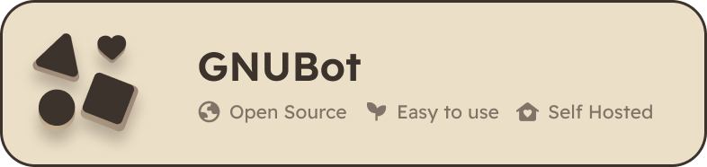
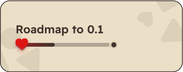

# GNUBot | An Open-Source Discord Bot



GNUBot is an open-source bot built using JavaScript. It is designed to be free as in freedom and price, offering a user-friendly deployment experience in local environments. GNUBot adheres to the following principles:

- It will never demand payment for its services.
- Your members will never encounter advertisements by GNUBot.
- Subscription fees will never be part of GNUBot's model.

> [!WARNING]  
> The dev branch is actively being developed, may contain bugs, and is not recommended for production use.    
> **Proceed with caution!**

<h4>
 <picture>
  <source media="(prefers-color-scheme: dark)" srcset="assets/readme/dark/Features.png">
  <source media="(prefers-color-scheme: light)" srcset="assets/readme/light/Features.png">
  
 </picture>
</h4>

- User-friendly deployment with an setup script to help you along the way.
- Easy local deployment with minimal hasle.
- Open-source and free to use for all.

<h4>
 <picture>
  <source media="(prefers-color-scheme: dark)" srcset="assets/readme/dark/Getting-Started.png">
  <source media="(prefers-color-scheme: light)" srcset="assets/readme/light/Getting-Started.png">
  
 </picture>
</h4>

### Prerequisites

Ensure you have the following installed:
- Node.js
- npm (Node Package Manager)

### Installation

> [!CAUTION]
> At the time of writing, the codebase and features mentioned are still in development.    
> Dev Branch is not recommended for production use. **Proceed with caution!**

1. Clone the repository
```bash
git clone https://github.com/astoko/GNUBot.git
```

2. Navigate to the project directory:
```bash
cd GNUBot
```

3. Install the dependencies:
```bash
npm install
```

4. Config the bot:
Configure the .env with the variables specified.
If you need more help or more information, visit our wiki.

### Running the Bot

To start the bot, run:
```bash
npm start
```
<h4>
 <picture>
  <source media="(prefers-color-scheme: dark)" srcset="assets/readme/dark/Frequently-Asked-Questions.png">
  <source media="(prefers-color-scheme: light)" srcset="assets/readme/light/Frequently-Asked-Questions.png">
  
 </picture>
</h4>


#### Why make this? Why Open Source?

I prefer having choices. Many Discord bots charge for basic features that Discord already provides, like welcome messages. This project makes those features free, breaking away from unnecessary subscriptions.

#### When stable release?

When it is stable.. that is far away from now..

<h4>
 <picture>
  <source media="(prefers-color-scheme: dark)" srcset="assets/readme/dark/Got-Stuck.png">
  <source media="(prefers-color-scheme: light)" srcset="assets/readme/light/Got-Stuck.png">
  
 </picture>
</h4>

Got stuck and can't figure out what is the problem? Here is a [handy dandy guide](https://github.com/astoko/GNUBot/wiki) for all your needs!  

<h4>
 <picture>
  <source media="(prefers-color-scheme: dark)" srcset="assets/readme/dark/License.png">
  <source media="(prefers-color-scheme: light)" srcset="assets/readme/light/License.png">
  
 </picture>
</h4>

This project is licensed under the [GNU GPLv3 License](LICENSE).

<h4>
 <picture>
  <source media="(prefers-color-scheme: dark)" srcset="assets/readme/dark/Join-us-at-our-Discord-Server!.png">
  <source media="(prefers-color-scheme: light)" srcset="assets/readme/light/Join-us-at-our-Discord-Server!.png">
  
 </picture>
</h4>

For any questions or suggestions, feel free to open an issue or reach out via GitHub or Join our [Discord Community Server](https://discord.gg/D96MATaPBe)

#




Enjoy using GNUBot! Made with ♥️ by GNUBot Team.

Concider Contributing to the project and soon enough (if i even set this up) buy me some coffee! 
